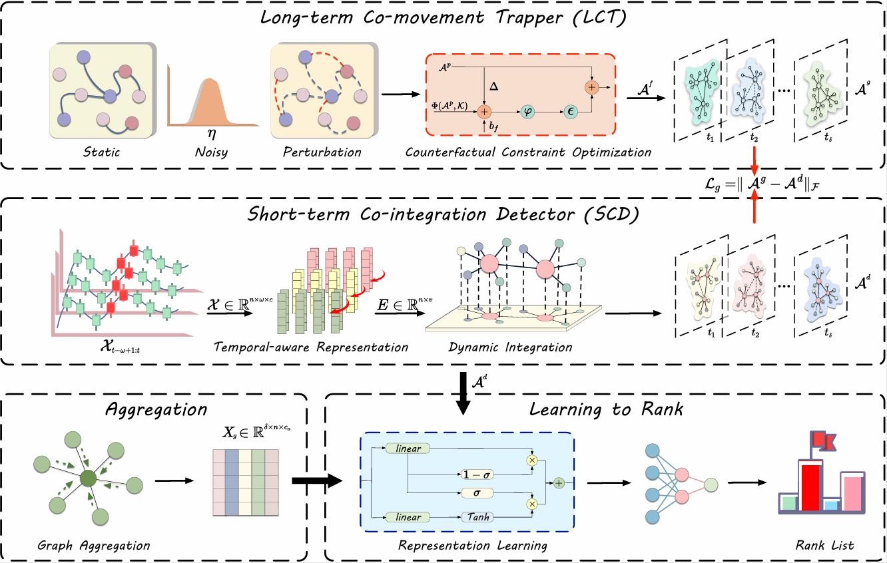

# Understanding Interactive Stock Dynamics via Sensitivity-aware Dependency Learning

This repository provides a reference implementation of the paper: *Understanding Interactive Stock Dynamics via Sensitivity-aware Dependency Learning*

## Overview

## Requirements

Make sure that you have the following dependencies done:

>empyrical==0.5.5  
>networkx==3.0  
>numpy==1.24.1  
>prefetch_generator==1.0.3  
>torch==2.1.1+cu121  
>torch_geometric==2.6.1    

You can install all the packages by running `pip install -r requirements.txt`. Please ensure to make minor adjustments to the versions based on your specific CUDA version and environment to avoid disrupting the existing setup.

## Datasets

We have uploaded all the datasets used in the paper to [Google Drive](https://drive.google.com/drive/folders/1VJ0jAf2V0K3tUMXqjgXAiOAJ8P3t8goW?usp=sharing). Please download them as needed and ensure to place the downloaded dataset folders in the `data` directory.

## Usage

Before running, make sure you have downloaded the dataset and put it in the correct place.

run `python train.py` to train and test.

